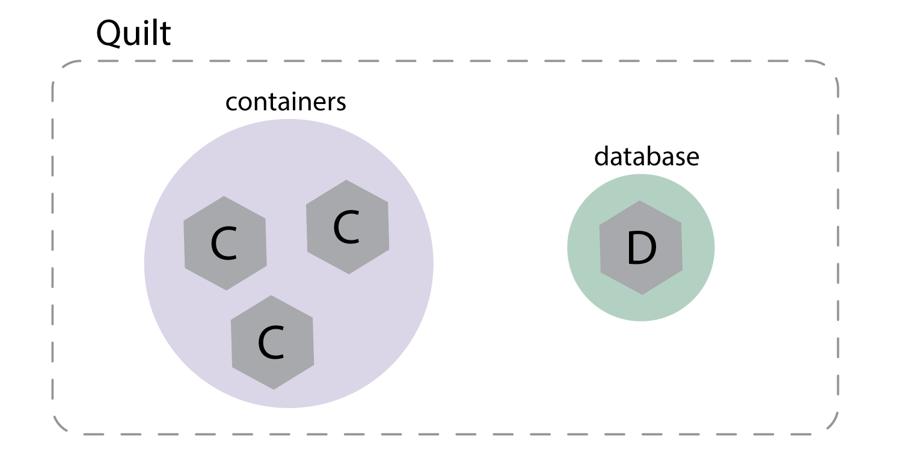

# Quilt

Quilt is a simple system to deploy and network containers  across public
clouds. Quilt enables one to create a complex distributed system of containers
by working only with a simplified abstract view of your system and not worrying
about the low-level implementation.

As systems grow, they become increasingly difficult to build, configure, and
maintain. For a distributed system to function well, it needs consistency among
its individual components, as well as flexible and reliable composition to
combine its individual components into a whole. Additionally, the system
requires comprehensive configuration to control things like data flow,
placement and access control.

Ensuring all of the above requirements is difficult, and in recognition of this
fact, several companies and open source projects have made good contributions
towards simpler system administration. However, even with these tools at hand,
it still requires carefully executed API calls and detailed understanding of a
system's underlying infrastructure to sucessfully build and maintain it.

With Quilt, you can leave these low-level details aside and instead focus on the
high-level structure and configuration of your system. For instance, for a
simple web deployment, we might want a database, some number of web servers
connected to the public internet, and some batch processing servers connected
to the web servers and the database. Even though this overall structure seems
simple, the actual implementation quickly becomes complicated.

Quilt enables you to bypass these complications and build your distributed system
from the top down, maintaining only an abstract view of your infrastructure and
a set of explicit policies it follows. You never have to worry about firewall
configurations, server placement or other implicit security enforcements; your
high-level view and explicit policies make it easy to monitor and verify the
state of your system. Regardless of whether your application is hosted on a
single or multiple cloud providers, Quilt ensures that your system is correctly
booted and that it always follows your configuration.

## Stitch -- The Quilt Language

As described above, Quilt allows you to forget about low-level specifics and
detailed API calls. With Quilt, you simply describe the desired state of your
system, and Quilt then handles the rest. To describe your configuration, you will
use two main building blocks: `atom`s and `label`s.

#### Atoms
An `atom` is the smallest unit of the Quilt language. Each `atom` is either an
administrative user, a public hostname or IP address, a container, or a virtual
machine. Simply creating an atom in your Quilt config file is enough to boot and
register the entity in your system. Similarly, if you want to shut down or
unregister a component of your system, you just remove the corresponding atom
in your config file.

By default, `atom`s in Quilt cannot communicate with each other due to an implicit
"deny all" firewall. Communication between `atom`s must therefore be explicitly
permitted by the `connect` keyword. This setup makes it easy to monitor and
manage data access in your system.

#### Labels
`label`s are logical groups of `atom`s and/or other `label`s. With `label`s you
can create named logical units within your system that you can then connect and
manage. For instance, after allowing connections from `label1` to `label2`, any
container in `label1` can connect to `atom`s in `label2` by opening a socket to
the hostname `label2.q`. If multiple atoms implement `label2`, Quilt will
automatically load balance new connections across all available `atom`s.

## Building a simple system

Before you start Quilt, you must specify the structure and requirements for
your distributed system in the config file. This file is written in the
declarative Quilt domain-specific language (`dsl`) that allows you to describe
your system in an clear and abstract manner. You might for instance specify the
cloud provider(s), the number of VMs, how many containers you want, what kind
of containers, logical groups (`label`s), as well as connections between
`label`s and/or the public internet.

As an example, to boot 3 docker containers with the latest Ubuntu image and a
postgres database, you put the following commands in your config file.

<!-- BEGIN CODE -->
    (label "containers" (makeList 3 (docker "ubuntu")))
    (label "database" (docker "postgres"))
<!-- END CODE -->

After this you will have a simple network:

We can easily expand our network to a basic deployment structure with the above database, a batch processing system and 5 Apache containers. As noted above, none of the containers can communicate by default, so we will furthermore open a few meaningful connections.

<!-- BEGIN CODE -->
    // Create 5 Apache containers, and label them "webTier"
    (label "webTier" (makeList 5 (docker "httpd")))

    // Create 2 Spark containers, and label them "batch"
    (label "batch" (makeList 2 (docker "spark")))

    // A deployment consists of a database, a webTier, and a batch processing
    (label "deployment" (list "database" "webTier" "batch"))

    // Allow the public internet to connect to the webTier over port 80
    (connect 80 "public" "webTier")

    // Allow the webTier to connect to the database on port 1433
    (connect 1433 "webTier" "database")

    // Allow the batch processer to connect to the database on and the webTier via SSH
    (connect 22 "batch" (list "webTier" "database"))

    // Allow all containers in the webTier to connect to each other on any port
    (connect (list 0 65535) "webTier" "webTier")
<!-- END CODE -->

After the above commands, our network looks a lot more interesting:

With the config file in place, Quilt will now boot your system. If you modify the configuration after the system booted, Quilt will make the corresponding changes to your system in the least distruptive way possible.

## Contributing
If you are interested in contributing to Quilt, check out [dev.md](dev.md) for development instructions, details about the code structure, and more.
