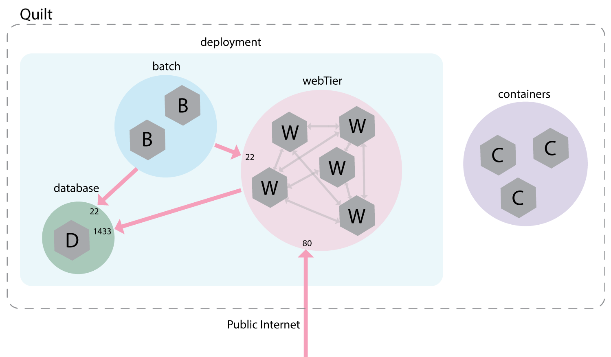

# Quilt

Quilt aims to be the easiest way to deploy and network containers.

Traditional container orchestrators have a procedural API focused narrowly on
compute.  The network, usually an afterthought, must be managed by a separate
system with its own independent API.  This leaves operators with a complex
task: write a deployment script that configures everything necessary to get
their application up and running.

Quilt takes a different approach.  It relies on a new domain specific language,
Stitch, to _specify_ distributed applications, independent of the specific
infrastructure they run on.  Given a stitch, Quilt can automatically deploy in
a variety of environments: Amazon EC2, Microsoft Azure, and Google Compute
Engine, with more coming soon.  Furthermore it can do this with **no setup** --
just point Quilt at a stitch and it will take care of the rest: booting virtual
machines, starting containers on those VMs, and ensuring they can communicate.

Quilt is currently in alpha and under heavy development. Please try it out!
We are eager for feedback!

You can find setup instructions and a quick tutorial at
[GettingStarted.md](docs/GettingStarted.md).

## Stitch

Stitch is a domain specific language based on Scheme and has many of the tools
one would expect: modules, functions, variables, arithmetic, etc.  In addition,
it has some primitives for describing an application -- the collection of
containers that should be running, and precisely which are _allowed_ to
communicate.

## A Simple Stitch

To declare 3 docker containers with the latest Ubuntu image and a postgres
database, one would use the following stitch:

<!-- BEGIN CODE -->
    (label "containers" (makeList 3 (docker "ubuntu")))
    (label "database" (docker "postgres"))
<!-- END CODE -->

This will produce a simple network:

Next, suppose we'd like to expand with a batch processing system and 5 Apache
containers. By default containers can't communicate, so we will have to add
some network connections.

<!-- BEGIN CODE -->
    // Create 5 Apache containers, and label them "webTier"
    (label "webTier" (makeList 5 (docker "httpd")))

    // Create 2 Spark containers, and label them "batch"
    (label "batch" (makeList 2 (docker "spark")))

    // A deployment consists of a database, a webTier, and a batch processing
    (label "deployment" (list "database" "webTier" "batch"))

    // Allow the public internet to connect to the webTier over port 80
    (connect 80 "public" "webTier")

    // Allow the webTier to connect to the database on port 1433
    (connect 1433 "webTier" "database")

    // Allow the batch processer to connect to the database on and the webTier via SSH
    (connect 22 "batch" (list "webTier" "database"))

    // Allow all containers in the webTier to connect to each other on any port
    (connect (list 0 65535) "webTier" "webTier")
<!-- END CODE -->

After the above commands, our application looks a lot more interesting:

With this stitch, Quilt can now boot the system. Furthermore, if the stitch is
modified, Quilt will automatically adapt by adding or removing containers as
necessary. You can learn the specifics of the Stitch language by reading
[Language.md](docs/Language.md).

## Contributing
If you are interested in contributing to Quilt, check out [Dev.md](docs/Dev.md)
for development instructions, details about the code structure, and more.

## Contact
Quilt is led by [Ethan J. Jackson](http://ejj.github.io/), a PhD student at
the UC Berkeley NetSys lab.  Feel free to direct questions, comments, and
inquiries to his email at
[ejj@eecs.berkeley.edu](mailto:ejj@eecs.berkeley.edu). Additionally, numerous
other contact methods may be found [here](http://ejj.github.io/contact.html).
